# JustBenchThatLLM

Stop guessing. Start measuring. Make data-driven decisions about your AI infrastructure.

Visual, reproducible benchmarking for LLM inference endpoints (vLLM, LM Studio, OpenAI-compatible APIs).


## The Challenge

**Stop wondering, start knowing:**

✓ **Version upgrades**: test vLLM updates before they hit production

✓ **Model performance**: benchmark Mistral-3B's actual speed on your infrastructure  

✓ **Load capacity**: discover real limits with stepped load testing

✓ **Optimization impact**: measure improvements, don't assume them


**JustBenchThatLLM gives you answers, not assumptions.**

## Why choose JustBenchThatLLM

### **Built for Comparison**

Designed from the ground up for **comparative analysis**:

- **Side-by-side radar charts** - Visualize multi-dimensional performance instantly
- **Historical tracking** - Compare today's deployment with last week's
- **Multi-run overlay graphs** - See performance trends across configurations

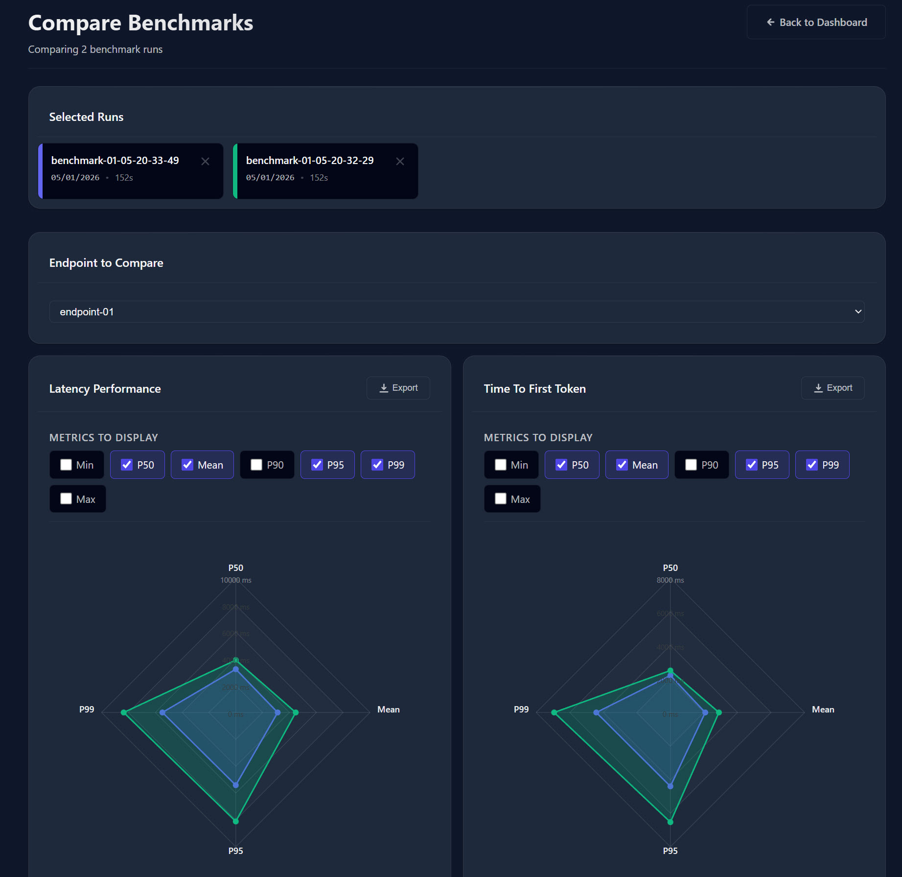

**Make informed decisions with battle-tested comparisons:**

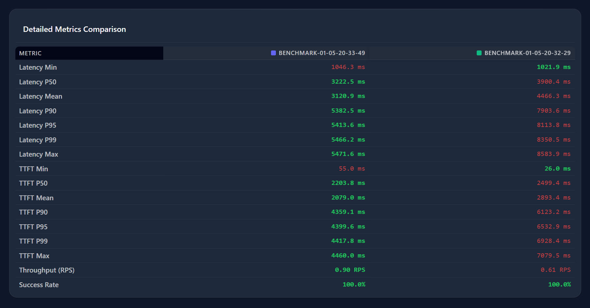

## Key Features

### Compare Everything

- **📈 Models**: Mistral vs Llama vs Qwen - same infrastructure, different models
- **🔧 Configurations**: test max_tokens, temperature, concurrency impacts  
- **📦 Libraries**: validate updates with confidence
- **🏗️ Infrastructure**: GPU vs CPU, different memory configs, scaling strategies


### Visual Intelligence

- **Stepped Load Analysis**: automatically find your breaking point

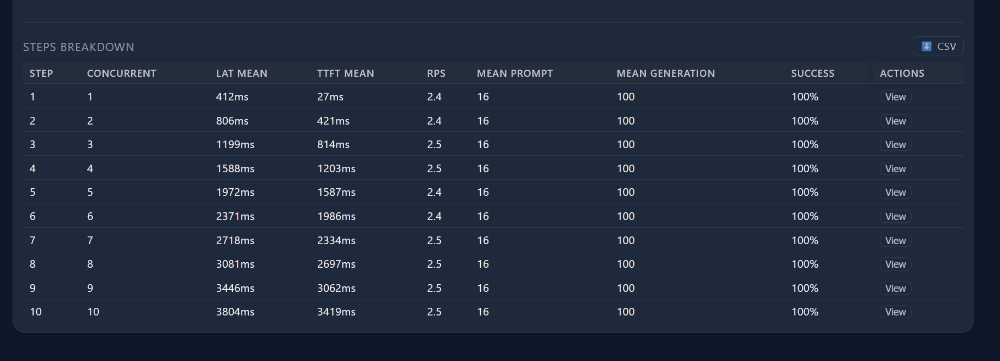

- **Interactive Dashboards**: filter, zoom, export - your data, your way

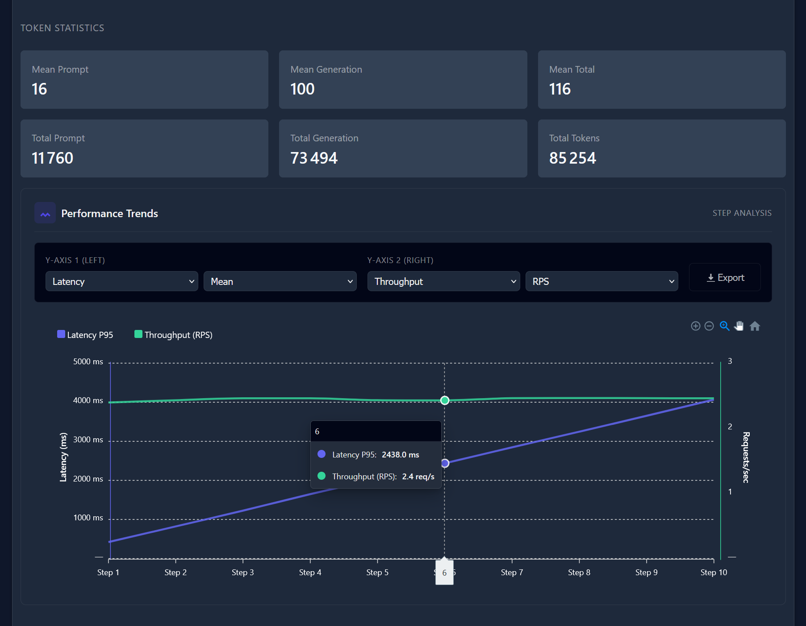


### Production-Grade Metrics

- **Latency Distribution**: Min, P50, P90, P95, P99, Max
- **TTFT (Time To First Token)**: critical for streaming applications  
- **Throughput**: requests/sec and Tokens/sec
- **Success Rates**: know when things break

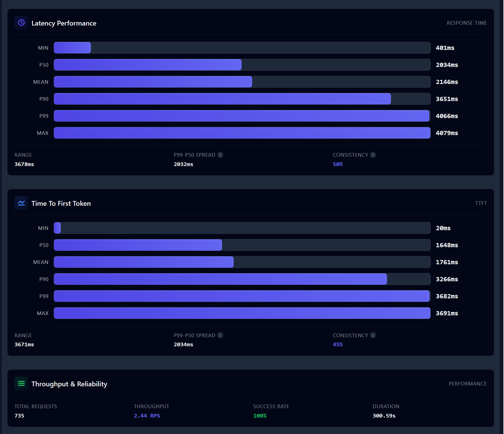


### Production-Ready
- 🐳 **Docker & Kubernetes**: deploy anywhere with Docker Compose or Helm charts
- 📈 **Export Everything**: CSV, JSON for further analysis
- 🔄 **Reproducible**: save and re-run exact configurations
- 🎨 **Dark Mode**: because your eyes matter 😊


## ⚡ Quick Start

### Docker Compose 

```bash
# Clone the repository
git clone https://github.com/redteams-fr/JustBenchThatLLM-docker
cd JustBenchThatLLM-docker

# Start container
docker-compose up -d

# Open http://localhost:8005

```

### Kubernetes with Helm

* Quickly deploy to your K8s cluster

```bash
helm install my-release ./helm/justbenchthatllm
```


## Platform Tour

### 1. Configure Your Endpoints

Set up multiple endpoints for comparison - vLLM, LM Studio, or any OpenAI-compatible API:

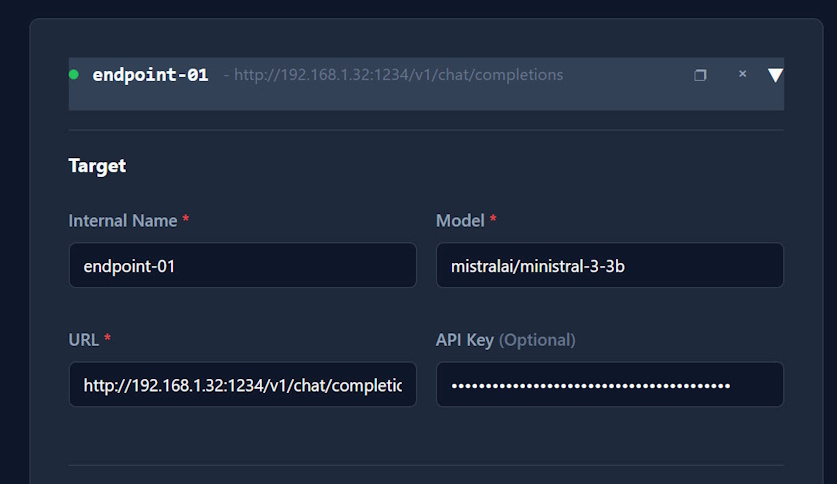

Test connectivity before running benchmarks:

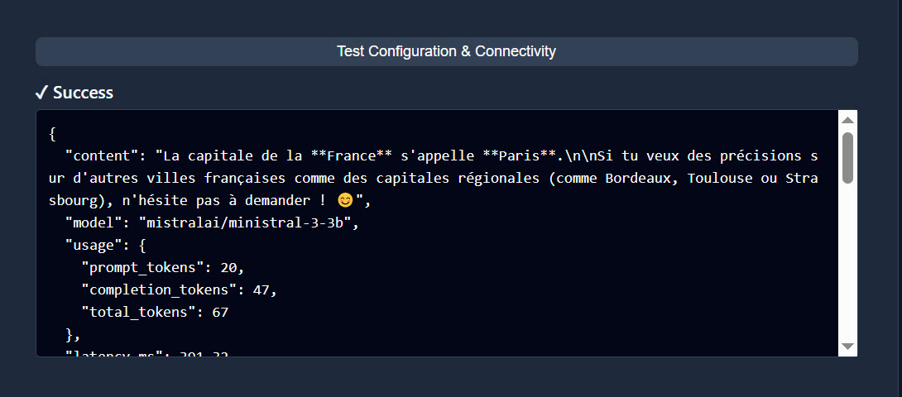

Need to re-run a benchmark? One click to duplicate with identical parameters:

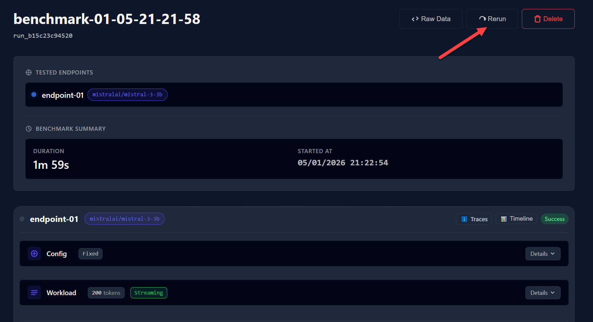


### 2. Design Your Workload
Configure realistic workloads that match your production patterns:


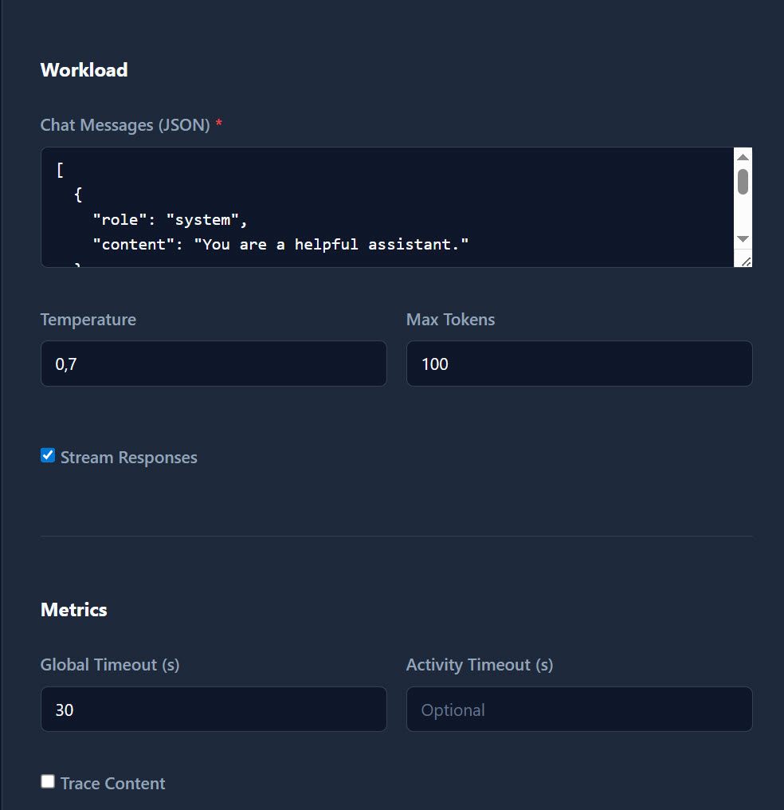


### 3. Dashboard - Mission Control


Monitor active benchmarks and access recent runs instantly:

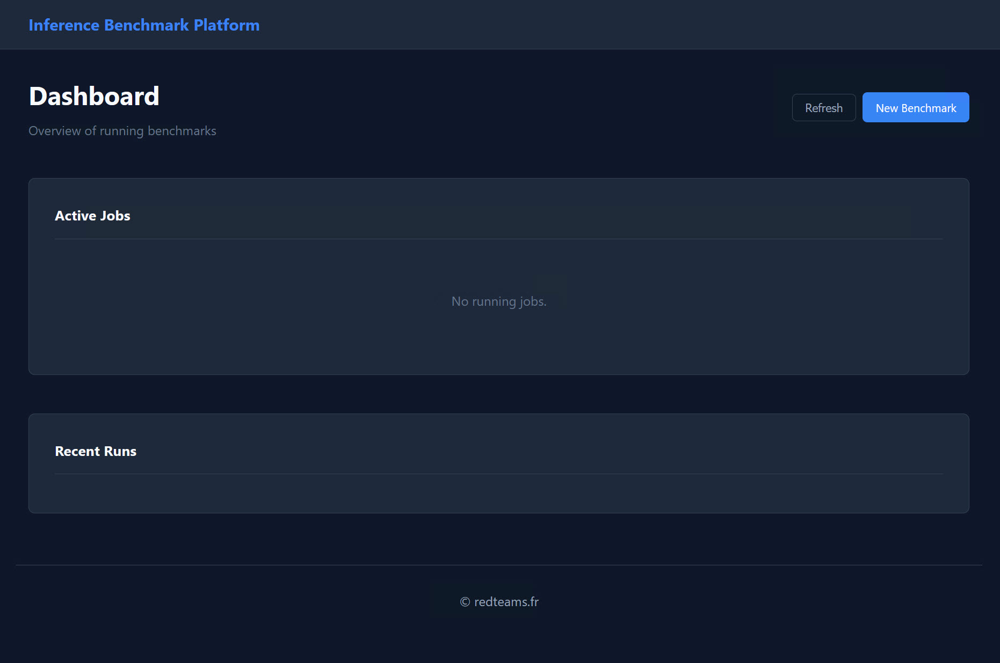

Powerful filtering by tags and date ranges to find exactly what you need:

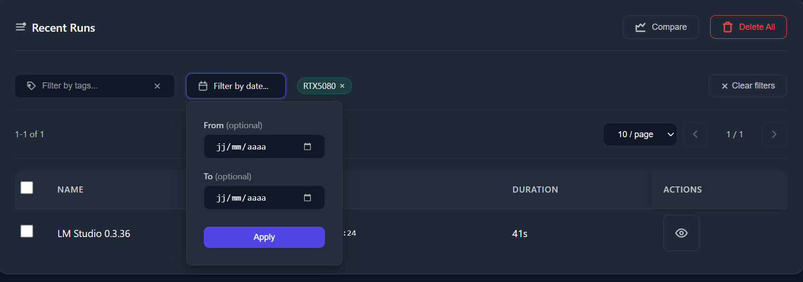


### 4. Deep Dive Analysis

Explore request-level details with interactive timeline view:

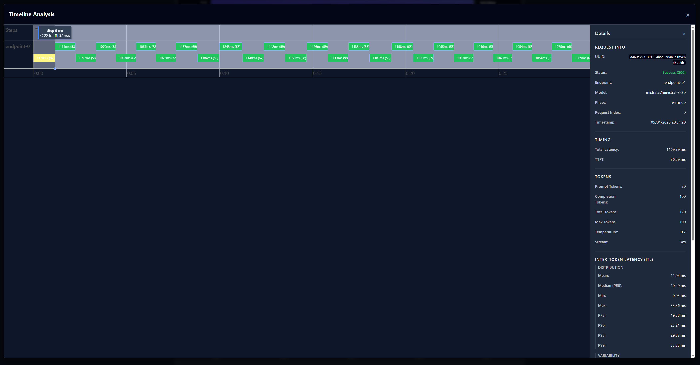

See exactly how each request performed, identify patterns, and spot anomalies.


## Real-World Use Cases

### For DevOps/SRE Teams
- **Pre-deployment validation**: Test infrastructure changes in staging
- **Capacity planning**: Data-driven scaling decisions
- **SLO definition**: Set realistic performance targets

### For ML Engineers & Data Scientists
- **Model selection**: Compare inference speed vs quality trade-offs
- **Configuration tuning**: Find optimal serving parameters
- **Library updates**: Validate new releases safely


## 📊 Benchmark Modes

### Fixed Load Mode
Test consistent performance under stable conditions - perfect for baseline establishment:


### Stepped Load Mode
Progressively increase concurrency to find your infrastructure's limits:


**Pro tip**: Use warmup requests to initialize your inference pipeline before measurements begin, ensuring more accurate results.


## Real-World Use Cases

### For DevOps/SRE Teams
- **Pre-deployment Validation**: Test infrastructure changes in staging with production-like loads
- **Capacity Planning**: Make data-driven scaling decisions based on actual performance metrics
- **SLO Definition**: Set realistic performance targets backed by empirical data

### For ML Engineers & Data Scientists
- **Model Selection**: Compare inference speed vs quality trade-offs across different models
- **Configuration Tuning**: Find optimal serving parameters for your specific use case
- **Library Updates**: Validate new framework releases without production surprises


---

**Built with ❤️ by [RedTeams.fr](https://redteams.fr)**

*Stop guessing. Start comparing. Ship with confidence.*
