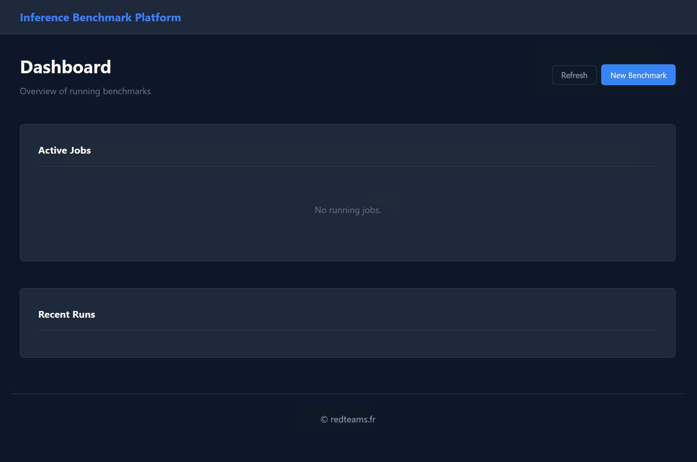

# JustBenchThatLLM

Benchmark an LLM endpoint without friction !

Visual, reproducible benchmarking for LLM inference endpoints (vLLM, LM Studio, OpenAI-compatible APIs).

**JustBenchThatLLM** lets you run load benchmarks against LLM inference APIs, track execution in real time, and analyze performance metrics such as latency, throughput, TTFT, and percentiles.

## Typical use cases

* Compare multiple models on the same hardware

* Measure the impact of streaming vs non-streaming

* Identify throughput limits of a vLLM server

* Validate inference performance before production

* Export data for offline analysis


# Quick start

```bash
docker compose up -d
```

Open the UI:

Go to http://localhost:8005 to access the application.


Enjoy !

---

# Interface

## Dashboard

Global view of running and completed benchmarks.



## Create a benchmark

Each endpoint is configured independently:

* Endpoint URL
* Model name
* Load mode
* LLM parameters


## Serving models

Example using LM Studio exposed as an OpenAI-compatible API.


## Running a benchmark

* Real-time progress tracking
* Per-endpoint execution status
* Live indicators


## Benchmark history

All previous runs remain accessible.


## Results

* Aggregated metrics
* Average latency
* Percentiles
* Throughput
* Time-to-First-Token (TTFT)


# Load modes

## Fixed load

* Constant concurrency

## Stepped load

* Progressive concurrency increase

* Identify saturation and breaking points