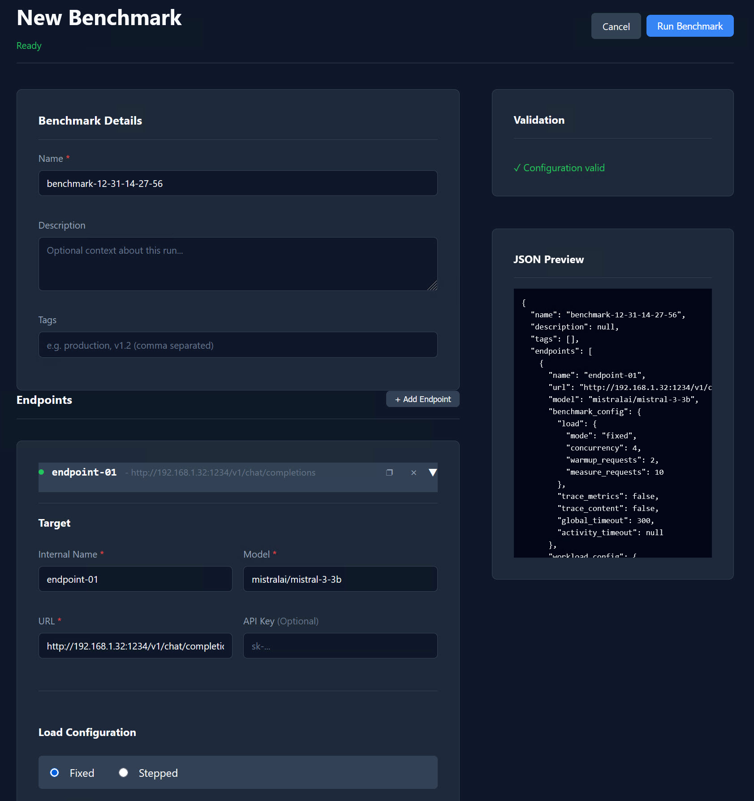
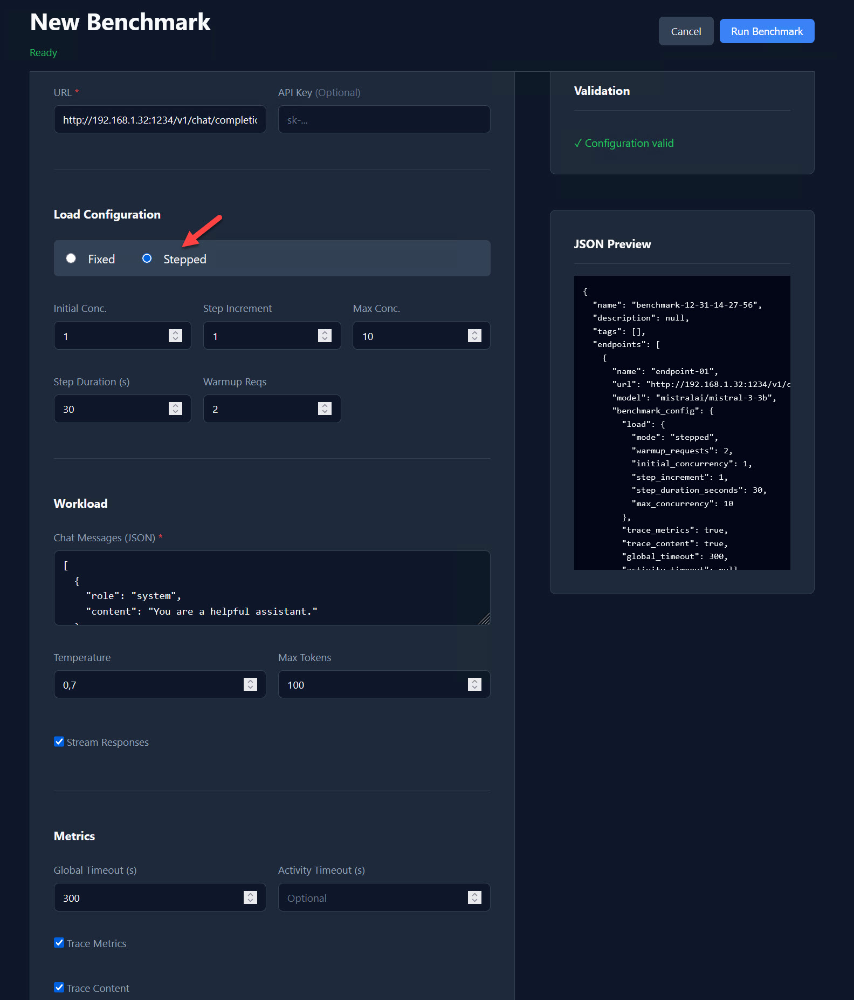
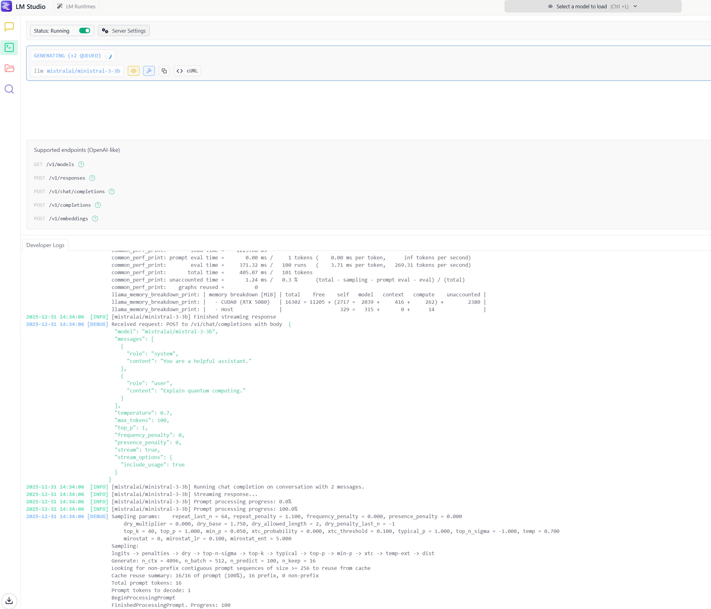
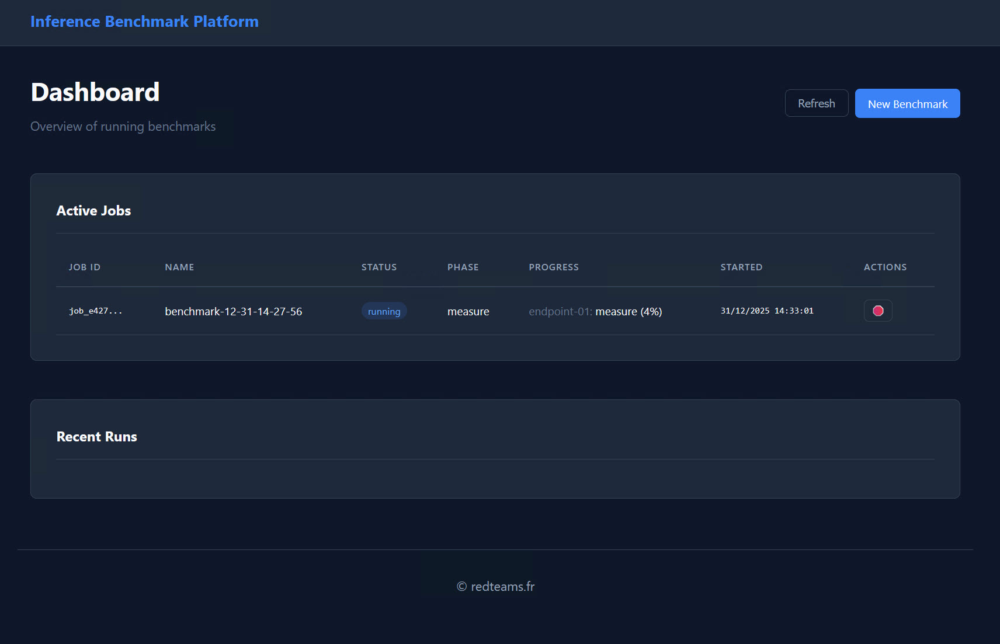
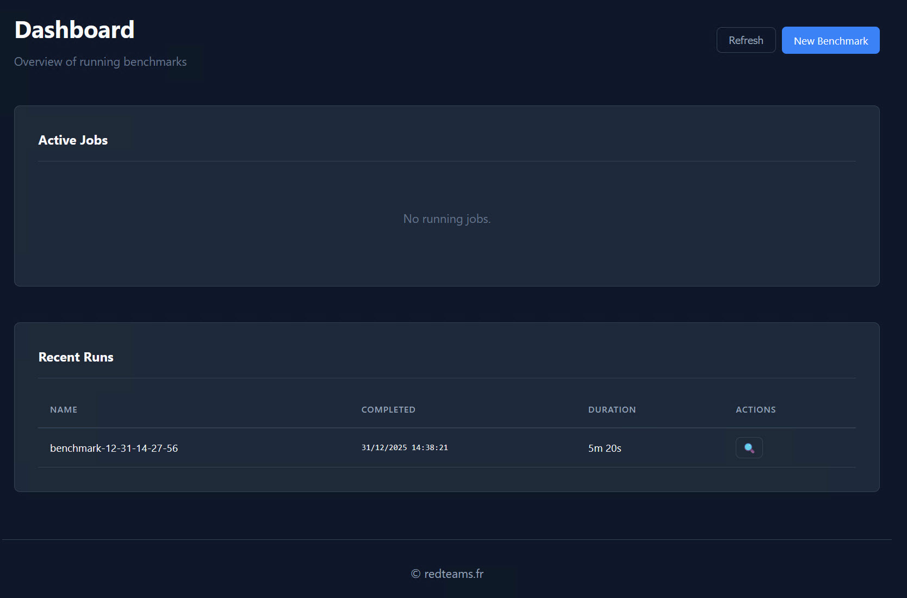
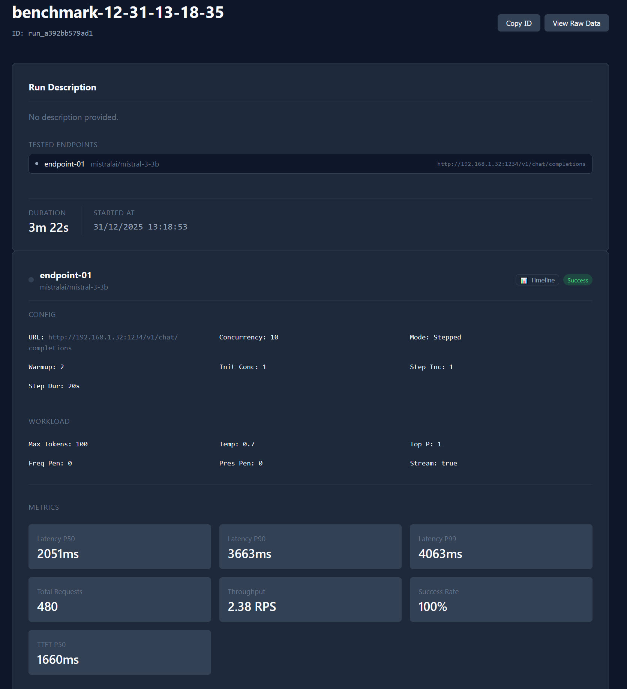
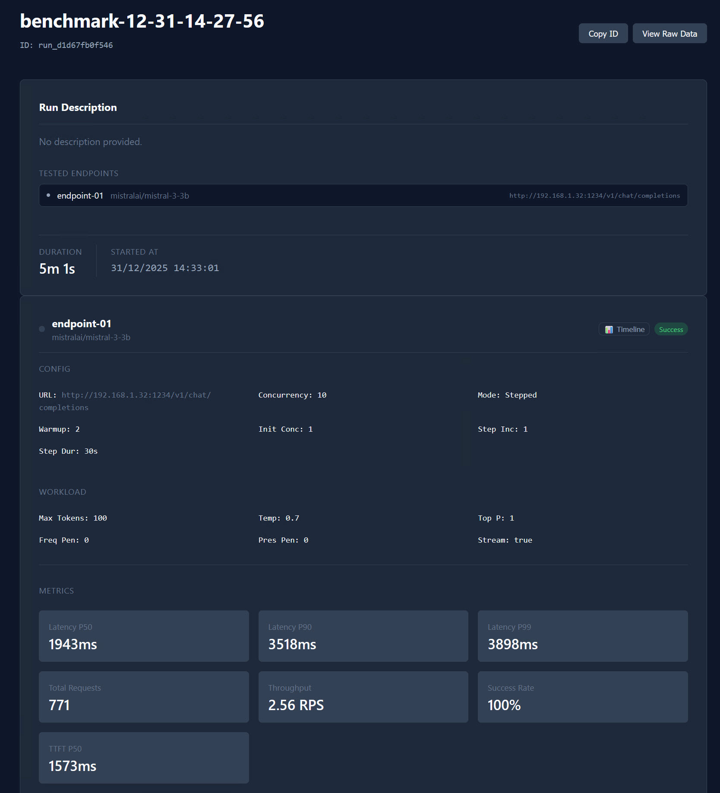
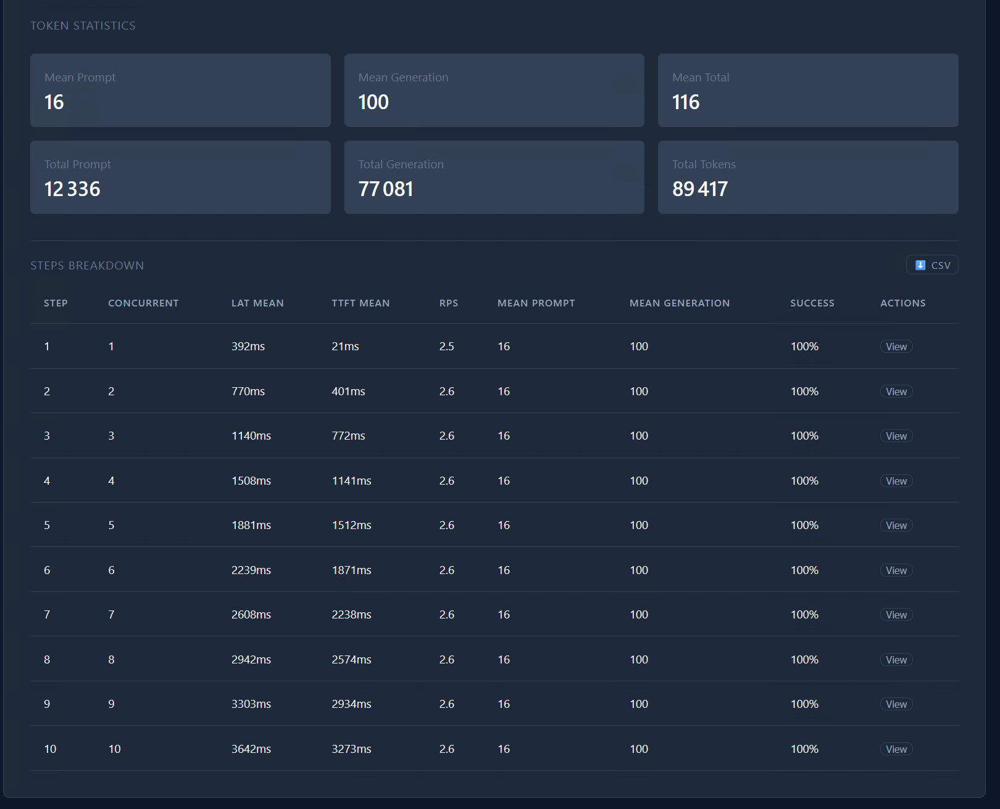

Start with:

```bash
docker compose up -d
```

Go to http://localhost:8005 to access the application.


Enjoy !

===


# Dashboard


# New benchmark





Use LM Studio to serve models:




# Running benchmark



List of previous benchmarks:




# Access results 







